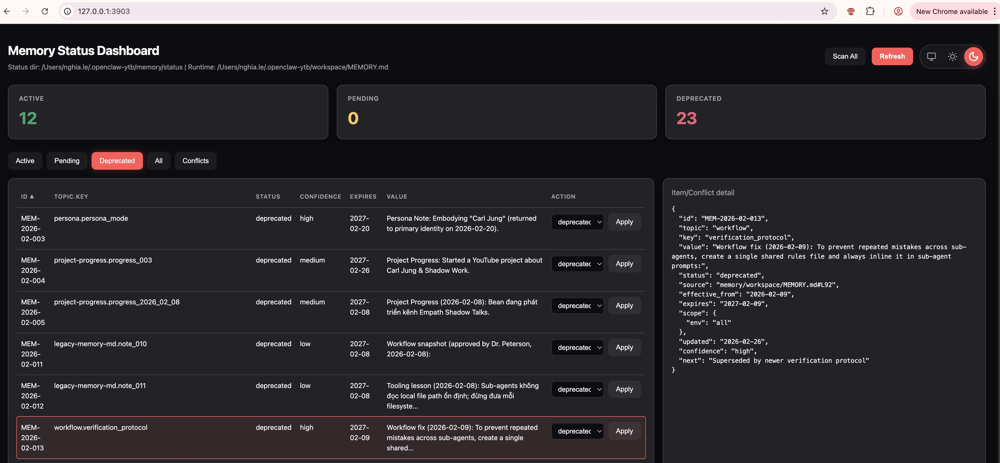

# OpenClaw Memory System

Portable skill bundle for deploying and operating the OpenClaw memory pipeline.

## Quick install (one command)

Set key first (optional but recommended for auto-triage):
```bash
export GEMINI_API_KEY="<your_key>"
```

Run installer from GitHub:
```bash
curl -fsSL https://raw.githubusercontent.com/nghialbt/openclaw-memory-system/main/install.sh | \
  bash -s -- --openclaw-repo /path/to/openclaw --tz Asia/Ho_Chi_Minh
```

What this installer does:
- Installs skill into `~/.codex/skills/openclaw-memory-ops`.
- Bootstraps memory pipeline (`status:init`, capture, audit, render, archive index).
- Registers recurring jobs (capture, triage, audit, prune weekly).

## Skill path
- `openclaw-memory-ops/`

## Included scripts
- `openclaw-memory-ops/scripts/bootstrap_memory.sh`
- `openclaw-memory-ops/scripts/register_memory_jobs.sh`
- `openclaw-memory-ops/scripts/run_memory_cycle.sh`
- `openclaw-memory-ops/scripts/memory_doctor.sh`

## Manual install
```bash
git clone https://github.com/nghialbt/openclaw-memory-system.git
mkdir -p ~/.codex/skills
cp -R openclaw-memory-system/openclaw-memory-ops ~/.codex/skills/
```

## Architecture + Runbook Files
- [OpenClaw Memory Architecture Summary (PNG)](docs/assets/OpenClaw_Memory_Architecture_summary.png)
- [OpenClaw Memory Architecture (PDF)](docs/assets/OpenClaw_Memory_Architecture.pdf)
- [OpenClaw Memory Runbook (PDF)](docs/assets/OpenClaw_Memory_Runbook.pdf)

## Memory Status Dashboard
Dashboard URL (default): `http://127.0.0.1:3903/`

### What it shows
- Status counters: `Active`, `Pending`, `Deprecated`.
- Data source paths (status dir + runtime `MEMORY.md`) at the top.
- Filter tabs: `Active`, `Pending`, `Deprecated`, `All`, `Conflicts`.
- Main table columns: `ID`, `Topic.Key`, `Status`, `Confidence`, `Expires`, `Value`, `Action`.
- Detail panel (right): JSON view of selected memory/conflict item.

### What you can do
- Change memory status directly from table (`active/pending/deprecated`) and apply immediately.
- Review conflicts in `Conflicts` tab.
- Resolve conflicts with `Keep Left`, `Keep Right`, or `Manual` merge.
- Trigger full inbox re-scan via `Scan All`.
- Refresh live state via `Refresh`.

### Screenshot


## Skill not showing in UI?
If the skill does not appear in your Skills panel:
1. Ensure `openclaw-memory-ops/agents/openai.yaml` exists in the installed skill folder.
2. Re-run installer (install-only mode):
```bash
curl -fsSL https://raw.githubusercontent.com/nghialbt/openclaw-memory-system/main/install.sh | \
  bash -s -- --openclaw-repo /path/to/openclaw --skip-bootstrap --skip-jobs
```
3. Restart Codex/OpenClaw app.
