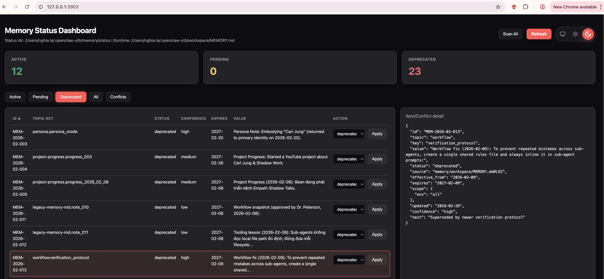

# OpenClaw Memory System

Portable skill bundle for deploying and operating the OpenClaw memory pipeline.

## 🛠 Prerequisites

Before installing, ensure you have:
- **Target Repo**: A local clone of the [OpenClaw / OpenClawYouTube](https://github.com/nghialbt/openclaw) repo.
- **Node.js**: Version 18 or higher.
- **pnpm**: Installed via `npm install -g pnpm`.
- **openclaw CLI** (Optional): Required for automated cron jobs.
- **GEMINI_API_KEY** (Optional): Required for AI-powered inbox triage.

## 🚀 Quick Install

### macOS / Linux
```bash
curl -fsSL https://raw.githubusercontent.com/nghialbt/openclaw-memory-system/main/install.sh | \
  bash -s -- --openclaw-repo /path/to/openclaw --tz Asia/Ho_Chi_Minh
```

### Windows
```powershell
git clone https://github.com/nghialbt/openclaw-memory-system.git
cd openclaw-memory-system
node install.mjs --openclaw-repo C:\path\to\openclaw --tz Asia/Ho_Chi_Minh
```

## 🏥 Health Check & Auto-Repair

After installation, always run the **Doctor** to verify everything is set up correctly:

```bash
# In the installed skill folder (~/.codex/skills/openclaw-memory-ops)
node scripts/memory_ops.mjs doctor --repo-root /path/to/openclaw
```

If the doctor reports missing `memory:*` scripts in your target repo, run with **`--fix`**:
```bash
node scripts/memory_ops.mjs doctor --repo-root /path/to/openclaw --fix
```

## ⚙️ Installer behavior
Installer performs:
- install skill into `~/.codex/skills/openclaw-memory-ops` (or `$CODEX_HOME/skills`),
- bootstrap memory pipeline (initial scan/render),
- register recurring jobs (if `openclaw` CLI is found),
- **auto-inject** memory runtime pack into your target repo (adds `memory:*` scripts to `package.json`).

To disable auto-patching:
```bash
node install.mjs --openclaw-repo /path/to/openclaw --skip-runtime-inject
```

## 📁 Included scripts
- **Core logic**: `scripts/memory_ops.mjs`
- **Wrappers** (macOS/Linux): `bootstrap_memory.sh`, `register_memory_jobs.sh`, `run_memory_cycle.sh`, `memory_doctor.sh`
- **Wrappers** (Windows): `bootstrap_memory.ps1`, `register_memory_jobs.ps1`, `run_memory_cycle.ps1`, `memory_doctor.ps1`

## 📊 Memory Status Dashboard
The dashboard provides a web interface to view and manage your memory state.

**To start:**
- macOS/Linux: `./manage.sh memory start` (in OpenClaw repo)
- Windows: `pnpm memory:dashboard:start` (in OpenClaw repo)

Dashboard URL: [http://127.0.0.1:3903/](http://127.0.0.1:3903/)



## 🏗 Architecture & Runbook
- [OpenClaw Memory Architecture Summary (PNG)](docs/assets/OpenClaw_Memory_Architecture_summary.png)
- [OpenClaw Memory Architecture (PDF)](docs/assets/OpenClaw_Memory_Architecture.pdf)
- [OpenClaw Memory Runbook (PDF)](docs/assets/OpenClaw_Memory_Runbook.pdf)

## ❓ Skill not showing in UI?
1. Ensure `openclaw-memory-ops/agents/openai.yaml` exists in the installed skill folder.
2. Re-run installer (install only):
   ```bash
   node install.mjs --openclaw-repo /path/to/openclaw --skip-bootstrap --skip-jobs
   ```
3. Restart Codex/OpenClaw app.
